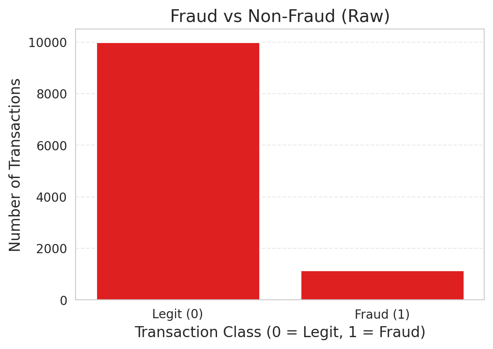
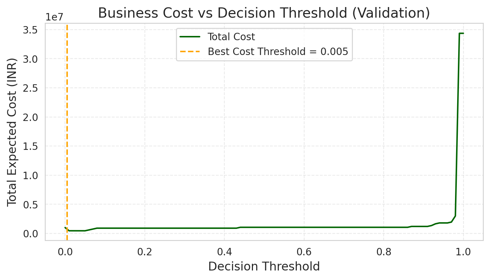
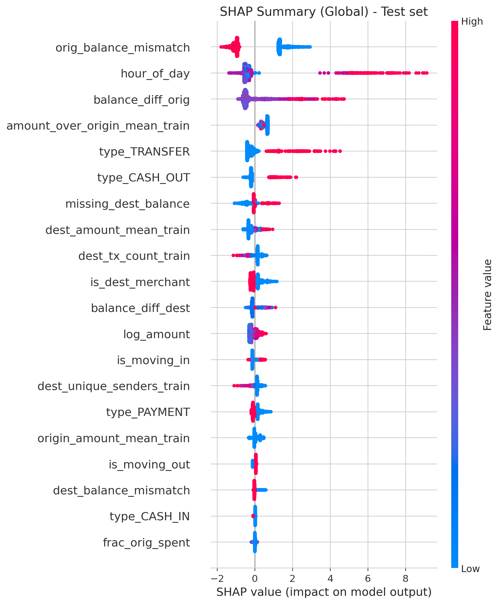

# fraud-detection-analytics
End-to-end fraud detection system using machine learning, cost-sensitive decision thresholds, explainability, and Power BI dashboards for business monitoring.

# Fraud Detection Analytics

## Business Problem
Financial transaction fraud is a high-impact problem with severe class imbalance.
False negatives (missed frauds) result in significant financial loss, while false positives increase operational costs.

This project focuses on building a fraud detection system that balances model performance with real business costs.

## Solution Overview
An end-to-end fraud detection pipeline combining:
- Feature engineering and leakage-safe aggregations
- Machine learning models with probability calibration
- Cost-sensitive decision thresholding
- Model explainability using SHAP
- Business monitoring using Power BI dashboards

## Data
The dataset contains anonymized transaction-level information including:
- Transaction amount and type
- Sender and receiver balances
- Temporal information

Raw data is not included in this repository. Sample and exported datasets are provided for reproducibility and visualization.

## Feature Engineering
Key engineered features include:
- Behavioral ratios (e.g., fraction of balance spent)
- Balance consistency checks
- Historical transaction aggregates (computed using training data only)
- Temporal patterns (hour of day)

All aggregations are computed in a leakage-safe manner.

## Modeling Approach
Multiple models were evaluated:
- Logistic Regression
- Random Forest
- XGBoost
- CatBoost

Model selection was based on cross-validated PR-AUC due to class imbalance.
Predicted probabilities were calibrated to support business decision-making.

## Evaluation Strategy
Evaluation focused on:
- PR-AUC and ROC-AUC
- Cost-based evaluation using business-defined false positive and false negative costs
- Confusion matrix analysis at selected decision thresholds

Decision thresholds were selected based on expected business cost minimization.

## Explainability
Model explainability was implemented using SHAP to:
- Identify globally important features
- Understand feature impact on fraud predictions
- Support stakeholder trust and auditability
### Key Results

#### Fraud vs Non-Fraud Distribution

#### Cost-Based Threshold Optimization

#### Model Explainability (SHAP)

## Power BI Dashboard
Power BI dashboards were built using exported model outputs to:
- Monitor fraud trends by transaction type and time
- Track high-risk transactions
- Visualize model-driven alerts
- Support operational decision-making
## Power BI Dashboard

The Power BI dashboard supports fraud monitoring, model governance, and investigation workflows.
### Data Flow for Reporting
Model predictions and engineered features are exported as CSV files and consumed by Power BI.
This separation ensures reproducibility, auditability, and safe sharing without exposing raw transaction data.

### Executive Overview

### Model Performance & Cost Trade-offs

### Fraud Investigation & Alerts

### Model Explainability

Screenshots of the dashboard are included in this repository.

## Limitations and Next Steps
- No real-time inference pipeline
- Concept drift not explicitly handled
- Future work includes automated retraining and real-time scoring
